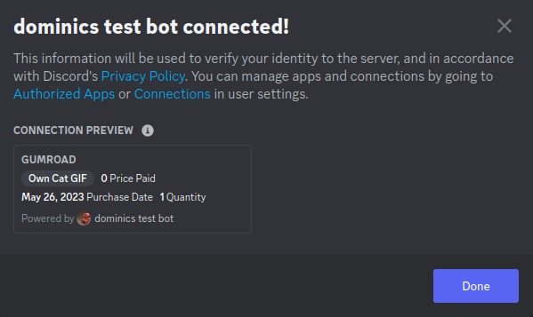

# gumroad-discord-link

Discord "linked roles" or "role connections" for Gumroad products. Need a septate Discord bot set up per product because of how Discord does the metadata stuff.

Checks info for Discord connection via Gumroad's "license key" feature.

```
#.env
  PORT="3000" # defaults 3000
  SELF_URL="" # no /, defaults to https://localhost:3000
  CLIENT_ID="" # Discord client ID
  BOT_TOKEN="" # Discord client ID
  CLIENT_SECRET="" Discord client secret
  PRODUCT_ID="" # Gumroad product ID. Shows up where you turn on license keys.
  PRODUCT_NAME="" # Name shown in Discord, "Owns [product name]". Defaults "some thing".
```



